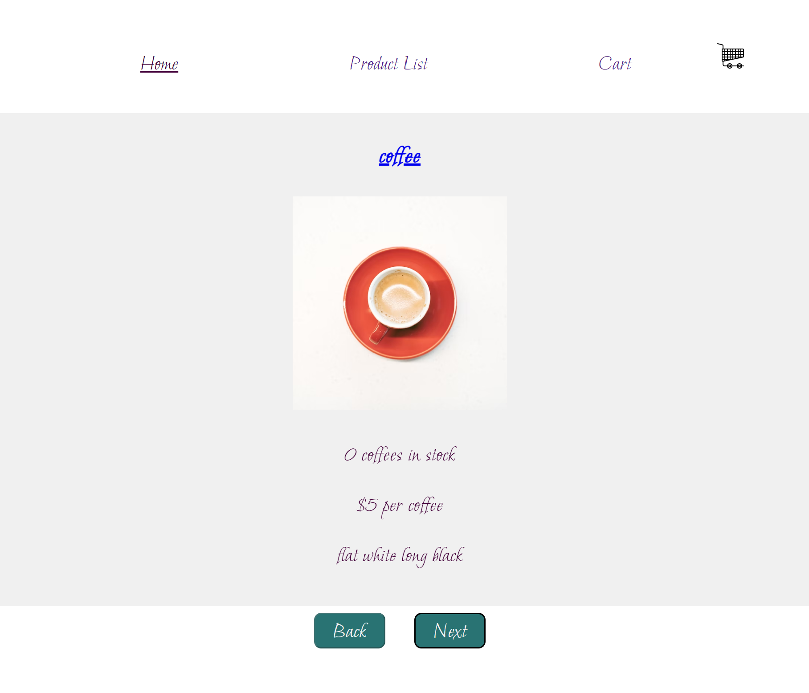

# E-Commerce React Project

## Link to Deployed Version

TBC

## Setup

In the project directory, you can run:
### `npm start`
Runs the app in the development mode.
Open http://localhost:3000 to view it in the browser. The page will reload if you make edits.
You will also see any lint errors in the console.

### `npm test`
Launches the test runner in the interactive watch mode. 

## Description of project (spec / MVP)

This project was designed to reinforce my React learnings and make sure that I am comfortable with most aspect of the framework. With this project I practiced how to:

- Fetch Data within a React App
- Use react-router-dom
- Use Firebase/Firestore

All products are stored in Firestore and fetched by the frontend. There are two databases: store for all product items and Cart for products chosen by the user.
Home Page has a Carousel of favourite products. The following library was used: pure-react-carousel
Product Page has a list of products. The user can open the Product Page for each product and add a Product into Cart.
Cart stores all products chosed by the User and shows the total amount to be paid. The user can remove all items from Cart

## Reflection

- I linked Firestore to my project and splitted the project into containters and components. The most enjoyable part was writing the logic that allows the frontend to communicate with Firestore.
- My main challenge was implementing the global context allowing to update the number of each product when a user adds products in the Cart.

## Future Goals

- Add dark mode
- Add an opportunity to choose different variants of the same product and add it into the Cart

### Stay in touch

- Email: ma.litvinova08@gmail.com
- Portfolio: https://litvinova08.github.io/portfolio-project/
- Linkedin: https://www.linkedin.com/in/margarita-l-44860b15b/

### Licence

- the MIT open source licence
